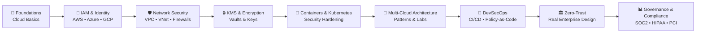

  
  
  
  

# 🌩️ **SecureTheCloud Knowledge Base**  
### *Multi-Cloud Security • Terraform • Zero-Trust • Architecture • Education*

Welcome to **SecureTheCloud**, a growing ecosystem built to help you:

- Learn cloud security from **beginner to architect**
- Understand multi-cloud through **simple analogies**
- Build secure environments with **hands-on labs**
- Visualize complex systems with **Mermaid diagrams**
- Follow real-world enterprise architecture patterns
- Study for certifications (AWS, Azure, GCP, Terraform, CKA/CKS)
- Practice on real, deployable cloud infrastructure

---

## 📘 **What is This Knowledge Base?**

This is your **full learning platform** for cloud security architecture.

Every topic includes:

✔ Beginner → Intermediate → Advanced  
✔ Visual diagrams  
✔ Hands-on example labs  
✔ Cloud provider comparison tables  
✔ Best practices  
✔ Security considerations  
✔ Binder-style PDF support  
✔ Multi-cloud mapping (AWS | Azure | GCP)

Think of this as your:

### 🧠 *Cloud Security Textbook + Lab Manual + Architecture Portfolio.*

---

# 🎓 **📚 Learning Path Overview**
A clean, visual map of your learning progression:

---

📘 Theory (Beginner → Architect)

Each module in /theory includes:

📝 Explanations using real-world analogies

🧠 Simplified cloud concepts

🌐 AWS vs Azure vs GCP comparison

🧱 Architecture patterns

🧩 How things fit together

🗺️ Mermaid diagrams

✔ Matching hands-on labs

Example:

IAM = Hotel Security (Badges, rooms, permissions)

VPC = Private Resort Property

KMS = Vault Room

API Gateway = Casino Entrance

CI/CD = Construction Workflow

🧪 Hands-On Labs (Your Real Cloud Practice)

Found in /labs, these labs follow this pattern:

✔ Concepts explained visually
✔ Deploy infrastructure
✔ Test security controls
✔ Harden configuration
✔ Destroy resources (avoid billing)
✔ Generate binder-style PDF

Examples:

IAM Lab (Users, Roles, Federation)

Network Isolation Lab

KMS Encryption Lab

Kubernetes Security Lab

Multi-Cloud Connectivity Lab

API Security + WAF Lab

Zero-Trust Deployment Lab

Each lab is a mini-portfolio project you can show recruiters.

🏗️ Terraform (Infrastructure-as-Code Learning)

Under /terraform, you learn:

Providers (AWS/Azure/GCP)

Modules

Environments

Private architecture patterns

Secure defaults

CI/CD pipelines

Policy-as-code (OPA/Sentinel)

This is the engineering foundation behind your labs.

🗺️ Architecture Diagrams (Mermaid + Cloud Patterns)

Under /diagrams/ you’ll find:

IAM flows

Zero-trust topologies

API request lifecycle

Data encryption flows

Multi-cloud traffic patterns

DevSecOps pipelines

All diagrams are easy to read and visually consistent.

🎥 YouTube — Learn Visually

📺 https://www.youtube.com/@SecureTheCloud

I break down:

Architectures

Certifications

Real job-role responsibilities

Hands-on labs

Resume + career strategies

---

💼 Consulting (SecureTheCloud.dev)

Organizations hire me for:

✔ Zero-trust architecture
✔ IAM modernization
✔ Multi-cloud design
✔ Cloud security reviews
✔ DevSecOps pipelines
✔ API security
✔ Team training
✔ On-going advisory

Visit the website:
🌐 https://securethecloud.dev

---
✨ Want to Support the Project?

If this knowledge base helps you:

⭐ Please consider starring the repository.

It supports the mission: teach modern cloud security to everyone.
