<<<<<<< HEAD

  
  
  
  

# 🌩️ **SecureTheCloud Knowledge Base**  
### *Multi-Cloud Security • Terraform • Zero-Trust • Architecture • Education*

Welcome to **SecureTheCloud**, a growing ecosystem built to help you:

- Learn cloud security from **beginner to architect**
- Understand multi-cloud through **simple analogies**
- Build secure environments with **hands-on labs**
- Visualize complex systems with **Mermaid diagrams**
- Follow real-world enterprise architecture patterns
- Study for certifications (AWS, Azure, GCP, Terraform, CKA/CKS)
- Practice on real, deployable cloud infrastructure

---

## 📘 **What is This Knowledge Base?**

This is your **full learning platform** for cloud security architecture.

Every topic includes:

✔ Beginner → Intermediate → Advanced  
✔ Visual diagrams  
✔ Hands-on example labs  
✔ Cloud provider comparison tables  
✔ Best practices  
✔ Security considerations  
✔ Binder-style PDF support  
✔ Multi-cloud mapping (AWS | Azure | GCP)

Think of this as your:

### 🧠 *Cloud Security Textbook + Lab Manual + Architecture Portfolio.*

---

# 🎓 **📚 Learning Path Overview**
A clean, visual map of your learning progression:

```mermaid
flowchart LR
    A[🌱 Foundations\nCloud Basics] --> B[🔐 IAM & Identity\nAWS • Azure • GCP]
    B --> C[🛡️ Network Security\nVPC • VNet • Firewalls]
    C --> D[🔒 KMS & Encryption\nVaults & Keys]
    D --> E[🐳 Containers & Kubernetes\nSecurity Hardening]
    E --> F[🧪 Multi-Cloud Architecture\nPatterns & Labs]
    F --> G[🚦 DevSecOps\nCI/CD • Policy-as-Code]
    G --> H[🏛️ Zero-Trust\nReal Enterprise Design]
    H --> I[📊 Governance & Compliance\nSOC2 • HIPAA • PCI]
```

---

📘 Theory (Beginner → Architect)

Each module in /theory includes:

📝 Explanations using real-world analogies

🧠 Simplified cloud concepts

🌐 AWS vs Azure vs GCP comparison

🧱 Architecture patterns

🧩 How things fit together

🗺️ Mermaid diagrams

✔ Matching hands-on labs

Example:

IAM = Hotel Security (Badges, rooms, permissions)

VPC = Private Resort Property

KMS = Vault Room

API Gateway = Casino Entrance

CI/CD = Construction Workflow

🧪 Hands-On Labs (Your Real Cloud Practice)

Found in /labs, these labs follow this pattern:

✔ Concepts explained visually
✔ Deploy infrastructure
✔ Test security controls
✔ Harden configuration
✔ Destroy resources (avoid billing)
✔ Generate binder-style PDF

Examples:

IAM Lab (Users, Roles, Federation)

Network Isolation Lab

KMS Encryption Lab

Kubernetes Security Lab

Multi-Cloud Connectivity Lab

API Security + WAF Lab

Zero-Trust Deployment Lab

Each lab is a mini-portfolio project you can show recruiters.

🏗️ Terraform (Infrastructure-as-Code Learning)

Under /terraform, you learn:

Providers (AWS/Azure/GCP)

Modules

Environments

Private architecture patterns

Secure defaults

CI/CD pipelines

Policy-as-code (OPA/Sentinel)

This is the engineering foundation behind your labs.

🗺️ Architecture Diagrams (Mermaid + Cloud Patterns)

Under /diagrams/ you’ll find:

IAM flows

Zero-trust topologies

API request lifecycle

Data encryption flows

Multi-cloud traffic patterns

DevSecOps pipelines

All diagrams are easy to read and visually consistent.

🎥 YouTube — Learn Visually

📺 https://www.youtube.com/@SecureTheCloud

I break down:

Architectures

Certifications

Real job-role responsibilities

Hands-on labs

Resume + career strategies

---

💼 Consulting (SecureTheCloud.dev)

Organizations hire me for:

✔ Zero-trust architecture
✔ IAM modernization
✔ Multi-cloud design
✔ Cloud security reviews
✔ DevSecOps pipelines
✔ API security
✔ Team training
✔ On-going advisory

Visit the website:
🌐 https://securethecloud.dev

---
✨ Want to Support the Project?

If this knowledge base helps you:

⭐ Please consider starring the repository.

It supports the mission: teach modern cloud security to everyone.
=======
SecureTheCloud Knowledge Base

  
 <h1 align="center">SecureTheCloud Knowledge Base</h1> 
 <strong>Your Living Multi-Cloud Security Playbook — Theory ✠Architecture ✠Hands-On Labs ✠Automation.</strong> 
 
     

📘 What Is This?

Welcome to the SecureTheCloud Knowledge Base —
your living textbook, lab environment, architecture library, and career accelerator.

This repository contains the evolving blueprint of a real enterprise-grade Multi-Cloud Security Architecture, including:

🔐 Cloud Security Architecture fundamentals

🔑 Zero-Trust Identity & Access

🔒 KMS, PKI, Encryption, mTLS

🌐 Multi-Cloud Networking

☁️ AWS / Azure / GCP platform security

🧪 Full hands-on labs

🎨 Enterprise diagrams

📚 Binder-style documentation

🛫 Real-World Airline Security Program (United Airline Case Study)

No boring README.
No random notes.
Everything structured. Everything visual. Everything actionable.

🧭 Living Directory — SecureTheCloud Learning Map

Each module includes:

📘 Theory
🧪 Lab
🎨 Diagram
📹 Video (when available)

🔐 Identity, Access & Zero-Trust
#	Topic	Theory	Lab	Diagram	Video
1	AWS IAM Identity Center (SSO) + Azure Entra SAML + SCIM	Theory
	Lab
	IAM Federation Flow	(coming)
2	Zero-Trust Identity Across Clouds	(coming)	(coming)	ZT Identity Map	(coming)
3	Multi-Cloud Federation (OIDC/SAML)	(coming)	(coming)	Federation Trusts	(coming)
🔒 Encryption, KMS, PKI & HTTPS
#	Topic	Theory	Lab	Diagram	Video
1	How HTTPS Works for Cloud Architects	Theory
	Lab
	Global TLS Map	(coming)
2	PKI, Certificates, mTLS	(coming)	(coming)	PKI Trust Chain	(coming)
3	AWS KMS / Azure KV / GCP KMS	(coming)	(coming)	Unified Key Architecture	(coming)
🌐 Multi-Cloud Networking & Zero-Trust Routing
#	Topic	Theory	Lab	Diagram	Video
1	Airline Zero-Trust Network (United Airline)	(coming)	(coming)	Airline Architecture	(coming)
2	Transit Gateway / VNet Peering / VPC-SC	(coming)	(coming)	Routing Map	(coming)
3	API Security Across Clouds	(coming)	(coming)	API Trust Boundary	(coming)
🛡 Kubernetes, Workload & Application Security
#	Topic	Theory	Lab	Diagram	Video
1	CKS — EKS, AKS, GKE Security	(coming)	(coming)	Pod-to-Pod mTLS	(coming)
2	Admission Control + OPA	(coming)	(coming)	Policy Flow	(coming)
3	Artifact Security	(coming)	(coming)	Supply Chain Map	(coming)
🎨 Master Mermaid Diagram — Architecture of This Knowledge Base
flowchart TB

    subgraph User["👤 Student / Architect"]
        READ[Browse Knowledge Base]
        WATCH[Watch YouTube Lessons]
        LABS[Run Live Multi-Cloud Labs]
    end

    subgraph Theory["📘 Theory Modules"]
        IDENTITY[Identity & IAM]
        TLS[HTTPS / TLS / PKI]
        NETWORKING[Multi-Cloud Networking]
        K8S[Kubernetes Security]
        COMPLIANCE[Security & Compliance]
    end

    subgraph Labs["🧪 Hands-On Labs"]
        AWS[AWS Labs]
        AZ[Azure Labs]
        GCP[GCP Labs]
        MULTI[Multi-Cloud Labs]
    end

    subgraph Visuals["🎨 Diagrams & Architecture"]
        MMD[Mermaid Diagrams]
        FLOW[Flowcharts & Architecture Maps]
        PDF[Binder-Style PDFs]
    end

    subgraph Content["🎥 YouTube Series"]
        INTRO[Concept Introductions]
        ADV[Deep Dive Sessions]
        DEMO[Live Lab Walkthroughs]
    end

    READ --> THEORYSEL((Select Topic))
    THEORYSEL --> IDENTITY & TLS & NETWORKING & K8S & COMPLIANCE

    WATCH --> Content
    LABS --> Labs

    Theory --> Visuals
    Theory --> Labs
    Labs --> Visuals

🏗 Folder Structure (Auto-Generated)
# Theory
mkdir -p theory/aws/identity-center
mkdir -p theory/security/https
mkdir -p theory/networking
mkdir -p theory/kubernetes

# Labs
mkdir -p labs/aws/identity-center
mkdir -p labs/security/https
mkdir -p labs/networking
mkdir -p labs/kubernetes

# Diagrams
mkdir -p diagrams/mermaid
mkdir -p diagrams/png

# Docs
mkdir -p docs/pdfs

Each folder already includes a README.md placeholder.

⭐ Completed Module (Just Delivered)
✅ AWS IAM Identity Center + Azure Entra SAML + SCIM (COMPLETE)

Includes:

Theory (coming)

Full Lab

Deep Troubleshooting (SAML, SCIM, Identity Provider Metadata)

Architecture Diagram

Binder PDF (optional)

Real corporate workflow

Use case: Enterprise Federation + SCIM provisioning

This is now part of the official SecureTheCloud curriculum.

⚡ Next Steps — Auto-Generate More Content

You can now ask the knowledge-base to generate:

“Generate the folder structure.”
“Generate the HTTPS theory module.”
“Generate the Azure lab.”
“Generate the banner pack.”
“Generate the binder PDF.”
“Generate the Kubernetes module.”

This repo is designed to grow automatically, one command at a time.

⭐ If you like this repository…

Please consider:

⭐ Starring the repo

🔁 Sharing it

🎥 Subscribing to the YouTube channel

🔔 Following SecureTheCloud.dev

Every star helps this knowledge-base grow and reach more cloud security engineers.
>>>>>>> 9df3254 (feat(identity-center): add AWS SSO (Entra ID) theory + lab; consolidate lab path; update root README)
