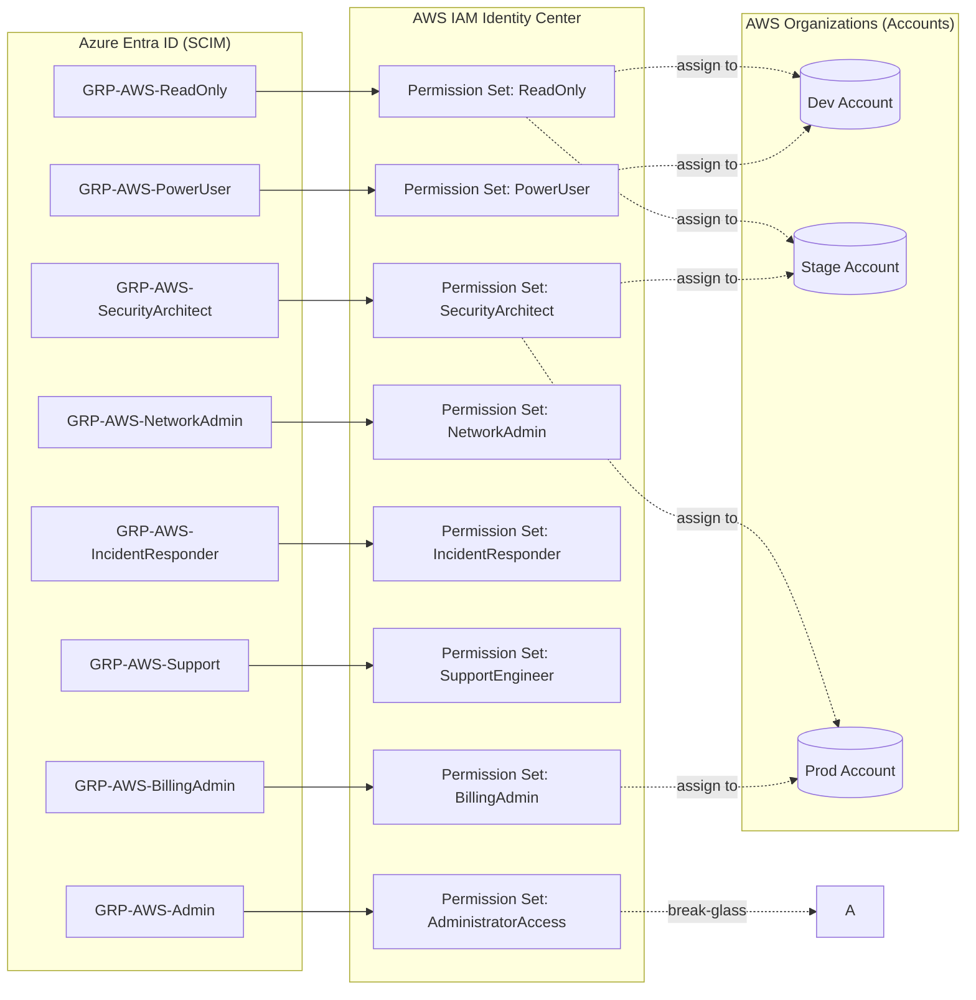

# Lab — Implement the Enterprise Permission Set Matrix (AWS SSO + Entra)

## Goal
Create the standard permission sets, map them to Azure Entra groups via SCIM, and assign them to AWS accounts.

---

## Prereqs
- AWS IAM Identity Center **enabled** and set to **External IdP (Azure Entra)**.
- SCIM provisioning **enabled** and healthy (Azure → AWS).
- You can sign into the **AWS access portal** successfully.

---

## Part A — Create Entra Groups (IdP side)
In Microsoft Entra:
1. Go to **Groups** → **New group**.
2. Create groups for each permission set, e.g.:
   - `GRP-AWS-Admin`
   - `GRP-AWS-PowerUser`
   - `GRP-AWS-SecurityArchitect`
   - `GRP-AWS-ReadOnly`
   - `GRP-AWS-BillingAdmin`
   - `GRP-AWS-BillingRO`
   - `GRP-AWS-NetworkAdmin`
   - `GRP-AWS-IncidentResponder`
   - `GRP-AWS-Support`
   - `GRP-AWS-K8sAdmin`
3. Assign appropriate **users** to each group.
4. Ensure the **AWS Enterprise App** is assigned to each group so SCIM can push them to AWS.

> Wait for provisioning or click **Provision on demand** for each group if testing.

---

## Part B — Create Permission Sets (AWS side)
AWS Console → **IAM Identity Center** → **Permission sets** → **Create**:

### Examples
1) **SecurityArchitect**
- Managed: `SecurityAudit`
- Inline (optional): cost visibility:
  - `ce:Get*`, `cur:Describe*`, `budgets:ViewBudget`
- Session duration: 1–4h
- Relay state (optional): `https://console.aws.amazon.com/cloudtrail/home`

2) **BillingAdmin**
- Managed: _(validate in your org)_
- Inline: 
  - `aws-portal:View*`,`aws-portal:Modify*`,`ce:*`,`cur:*`,`budgets:*`
- Session duration: 1–2h

3) **ReadOnly**
- Managed: `ReadOnlyAccess`

4) **PowerUser**
- Managed: `PowerUserAccess`

5) **SupportEngineer**
- Managed: `AWSSupportAccess`

6) **IncidentResponder**
- Managed: `SecurityAudit`
- Inline: logs + trails + guardduty + securityhub read (see matrix)

7) **NetworkAdmin**
- Managed: start from `ReadOnlyAccess`
- Inline: VPC/TGW/VPN/Routes/DNS admin (see matrix)

> Repeat for the remaining roles.

---

## Part C — Assign Groups to Accounts
1. Identity Center → **AWS accounts** → select account.
2. **Assign users or groups**.
3. Choose the Entra Group (e.g., `GRP-AWS-ReadOnly`), then choose the Permission Set (e.g., `ReadOnly`).
4. Submit and wait for **Provisioned** state.

> Repeat per account and role.

---

## Part D — Validate
- Sign into **AWS Access Portal**.
- Confirm tiles show expected account/role combinations.
- Try opening **Billing** with BillingAdmin vs. ReadOnly (Access Denied as expected).
- CloudTrail shows **AssumeRole** events for SSO roles; validate session durations and MFA in Azure.

---

## Part E — Operational Hygiene
- Review assignments monthly.
- Remove stale groups from Entra.
- Shorten session durations for Admin.
- Capture ticket IDs in session tags (advanced).
- Run Access Analyzer across roles.

---

## Next
- Document this lab in your Binder series.
- (Optional) Implement Terraform for permission sets + assignments once the naming model is stable.
Save & exit.
4) Diagram (Mermaid)
File: diagrams/aws/iam-ic-permission-sets.mmd
bash
Copy code
nano diagrams/aws/iam-ic-permission-sets.mmd
Paste this content:

