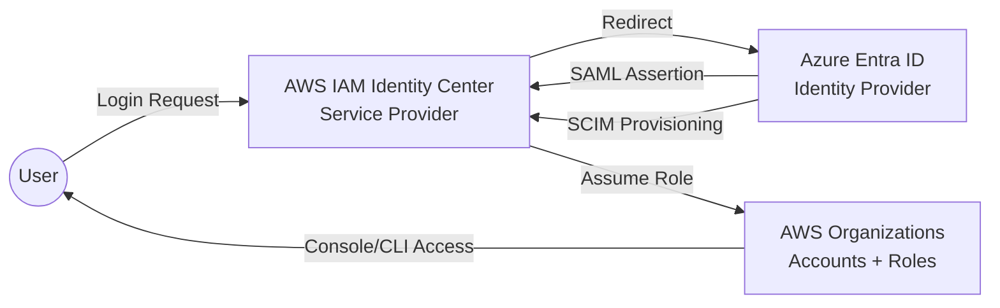

🔐 AWS IAM Identity Center (SSO) — Theory Module

Multi-Cloud Identity Federation with Azure Entra ID & SCIM Provisioning

```mermaid
flowchart TD

    %% Azure Entra ID
    subgraph A [Azure Entra ID — Identity Provider]
        A1[User & Group Directory]
        A2[SAML 2.0 Identity Provider<br>Token Issuer]
        A3[SCIM Provisioning Service]
    end

    %% AWS IAM Identity Center
    subgraph B [AWS IAM Identity Center — Service Provider]
        B1[SAML 2.0 Service Provider<br>(ACS, Entity ID)]
        B2[SCIM Provisioning Client<br>(Users & Groups)]
        B3[Permission Sets<br>Role Templates]
        B4[AWS Accounts<br>Organization Units]
    end

    %% Authentication Flow
    subgraph C [Authentication Flow — SAML]
        C1[AWS SSO URL Access]
        C2[Redirect to Azure Entra ID]
        C3[User Authenticates<br>MFA + CA Policies]
        C4[SAML Assertion Sent to AWS]
        C5[STS Role Issued<br>Console Access Granted]
    end

    %% Provisioning Flow
    subgraph D [Provisioning Flow — SCIM]
        D1[Azure Detects<br>User or Group Changes]
        D2[SCIM Push to AWS]
        D3[AWS Updates its<br>Identity Store]
        D4[Permission Set Assignments<br>Recomputed]
    end

    %% Flow Connections
    C1 --> C2 --> C3 --> C4 --> C5

    D1 --> D2 --> D3 --> D4

    %% Cross-System Trusts
    A2 -.->|SAML Trust| B1
    A3 -.->|SCIM Sync| B2

    %% Internal Connections
    A1 --> A2
    A1 --> A3

    B1 --> B3
    B2 --> B3
    B3 --> B4

    C5 --> B4

    %% Styling
    style A fill:#0078d4,color:white
    style B fill:#ff9900,color:white
    style C fill:#4285F4,color:white
    style D fill:#34A853,color:white
```

📘 Module Overview

This module explains Identity Federation, SAML, SCIM, and how AWS IAM Identity Center (SSO) integrates with Azure Entra ID to provide:

Centralized Authentication

Centralized Authorization

Just-in-time user lifecycle management

Enterprise-grade federation

Multi-account AWS access via Role-based Permission Sets

Zero-trust identity boundaries

This is the architectural foundation for building secure, scalable, multi-cloud identity.

1️⃣ What Problem Does AWS SSO Solve?
Before SSO

Organizations had:

Local AWS IAM users (per-account)

Manual password rotation

Manual MFA configuration

No central identity provider

No lifecycle automation

No unified audit trail

This created:

❌ Identity sprawl
❌ Weak lifecycle controls
❌ 10+ AWS accounts = 10 identities per engineer
❌ No SCIM provisioning
❌ No Microsoft Entra compliance policies

After SSO + Entra ID Federation

AWS becomes a Service Provider (SP).
Azure Entra becomes the Identity Provider (IdP).

✔ Single Login (Microsoft)
✔ MFA from Azure
✔ Conditional Access
✔ Automated user provisioning
✔ SCIM lifecycle management
✔ Least privilege via AWS Permission Sets
✔ Zero-trust enforced at identity layer

You now secure AWS with the same enterprise identity program used for Office365, Teams, Defender, etc.

2️⃣ How Federation Works (Identity Plane)

Federation between Azure Entra ID and AWS SSO relies on two major protocols:

🔹 A. SAML 2.0 → Authentication

SAML provides the login handshake:

Component	Role
Azure Entra ID	Identity Provider (IdP)
AWS IAM Identity Center	Service Provider (SP)
SAML Assertion	Token containing user identity + attributes

AWS trusts the signed SAML assertion from Azure, meaning:

AWS does not see your password

AWS never owns your identity

Azure fully controls login, MFA, CA policies, device compliance, etc.

SAML Covers:

“Who are you?”

“Did you pass MFA?”

“Are you allowed to login?”

🔹 B. SCIM → Provisioning

SCIM = System for Cross-domain Identity Management

Purpose → Sync users/groups from Azure → AWS.

Azure Entra creates & updates:

Users

Display names

Emails

Group assignments

AWS SSO does NOT sync groups from Azure automatically — Azure SCIM pushes them.

SCIM Covers:

“Who exists?”

“Who belongs to what group?”

“Which accounts should appear in AWS?”

“Should this person be deleted/disabled?”

🔹 C. Combined Authentication Flow
Login Flow:

User goes to AWS access portal

AWS redirects to Azure

Azure prompts MFA / CA policies

Azure issues SAML Assertion

AWS SSO maps user → Permission Sets

User is granted access to AWS Console or CLI

Provisioning Flow:

Admin assigns user to AWS SSO application in Azure

Azure SCIM sends user → AWS identity store

Admin assigns permission sets in AWS SSO

User gets account access

These are independent, but both required for enterprise identity.

3️⃣ Identity Architecture — What Actually Gets Built?

Below is the AWS–Azure identity architecture you built, shown in three layers:

🔹 Layer 1 — Identity Provider (Azure Entra ID)

Azure handles:

Username / Password

MFA

Conditional Access

Device trust / compliance

Identity governance

Group membership

SCIM provisioning

Azure issues signed SAML tokens AWS trusts.

🔹 Layer 2 — Service Provider (AWS SSO)

AWS handles:

Permission Sets

Account assignments

Role assumption

AWS Organization integration

SCIM user directory

AWS CLI v2 SSO login

AWS never validates MFA.
AWS only trusts the SAML signature.

🔹 Layer 3 — AWS Organizations (Authorization Plane)

AWS SSO maps:

Azure User/Group → AWS Permission Set → AWS Account → IAM Role

This produces:

Least privilege

Multi-account access

Central access point

Complete separation of authentication & authorization

This is core zero-trust identity.

4️⃣ Key Concepts Architects Must Understand
🔥 1. Identity is not stored in AWS

AWS becomes identity-less.
No AWS-native IAM users are required.

Identity is fully external (Azure).

🔥 2. Access is granted by Permission Sets

A Permission Set = IAM role template.

Examples:

Security Architect

Network Admin

DevOps Engineer

ReadOnly

Permission Sets → map to → IAM Roles in every AWS account.

🔥 3. AWS access portal becomes the single entry point

All users log in at:

https://<your-aws-sso-portal>.awsapps.com/start


They see:

All AWS accounts they have access to

All roles they can assume

🔥 4. Azure controls login, AWS controls authorization

Azure = Authentication
AWS = Authorization

This separation is a zero-trust requirement.

🔥 5. SCIM is mandatory for enterprise setups

Without SCIM:

No lifecycle automation

No auto-remove on termination

No group-based access

Manual identity sync

With SCIM:

✔ Automated joiner/mover/leaver
✔ Azure groups drive access
✔ HR system can drive identity lifecycle

5️⃣ What We Built (This Module)

Your implementation successfully configured:

✅ AWS SSO as a SAML Service Provider

Metadata exchange

Entity ID

ACS URL

Reply URL

SAML certificates

NameID mappings

✅ Azure Entra ID as the Identity Provider

SAML SSO

Token signing certificate

Identifier & Reply URL

Claims mapping (email → NameID)

✅ SCIM Provisioning

AZ → AWS user sync

Group provisioning

Lifecycle automation

✅ Permission Sets

"Security Architect" role provisioned

Account mapped to user

AWS access portal functioning

Your setup is production-grade.

6️⃣ Architecture Diagram (High-Level)

(Will be placed in diagrams/mermaid/aws-sso.mmd)



7️⃣ Exam-Level Summary (Cloud Architect)

AWS IAM Identity Center integrated with Azure Entra ID provides:

Central identity management

SAML-based authentication

SCIM-based user provisioning

Zero-trust identity boundaries

Enterprise login enforcement

Unified MFA & Conditional Access

Multi-account AWS governance

This is the baseline identity architecture for all modern cloud security programs.
