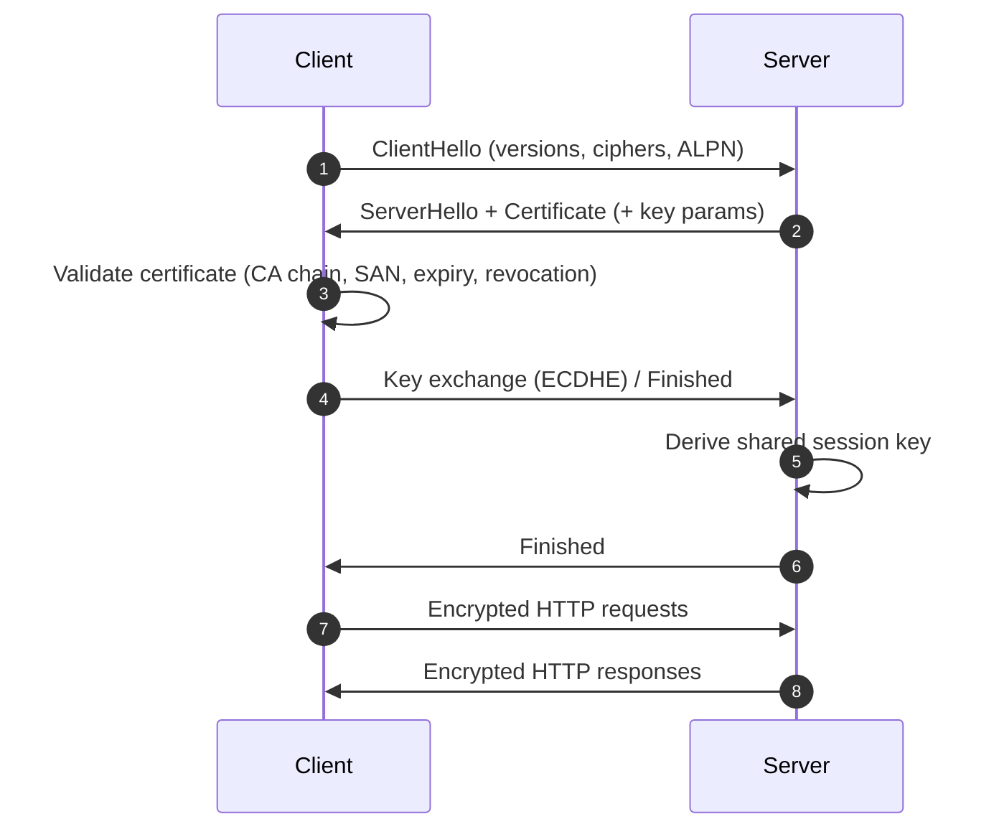

# 🔐 HTTPS for Cloud Security Architects

> From “padlock in the browser” to **production-grade, multi‑cloud TLS** decisions.

## 🎯 Learning Objectives
- Explain the HTTPS (TLS) handshake, session keys, and certificate validation.
- Make **architect decisions**: where to terminate TLS, when to re‑encrypt, when to use mTLS.
- Apply HTTPS across **AWS, Azure, and GCP** with consistent controls.
- Map HTTPS to **Zero‑Trust** and **STRIDE** threat modeling.

---

## 1) Mental Model — The Secure Courier
- Certificate = government ID of the server.
- Handshake = agreeing a one‑time **secret** (session key).
- All traffic after the handshake = **encrypted with the session key** (fast symmetric crypto).
- Anyone on the wire sees **movement** but not **content**.

---

## 2) TLS 101 (What Actually Happens)
1. **ClientHello**: client proposes TLS version + cipher suites.
2. **ServerHello**: server chooses the suite and sends its **certificate** (public key + CA chain).
3. **Certificate Validation** (client side):
   - Chain is signed by a trusted CA.
   - Name matches (SAN/CN).
   - Not expired; not revoked (OCSP/CRL; OCSP stapling when enabled).
4. **Key Exchange** (typically ECDHE): both sides derive a shared **session key** without revealing it.
5. **Session**: traffic is encrypted (AEAD ciphers) and integrity‑protected.
6. **Session Resumption** (optional): faster reconnects, lower latency.

> TLS 1.3 simplifies handshakes (fewer round trips) and removes legacy cipher baggage. Prefer **TLS 1.2+**; enable **TLS 1.3** where available.

---

## 3) Where HTTPS Fits in Cloud Architecture
**External:**  
Browser → Edge (CDN/WAF) → L7 LB → App/API

**Internal:**  
Service → Service (mTLS via mesh) → Data plane → Secrets/KMS

**Identity:**  
OIDC/SAML token exchanges, cookies, sessions — **must** be carried over TLS.

---

## 4) Architect’s Decisions (You Own These)
- **TLS termination point(s)**: Edge (CDN / Front Door), Gateway/LB, App/Pod.
- **Re‑encryption**: HTTP → TLS hop inside the perimeter (often required for compliance).
- **mTLS**: mutual authentication for **service‑to‑service** calls.
- **Cipher policy**: allowlist modern ciphers; disable legacy suites.
- **Certificates**: issuance, storage (KMS/HSM), rotation, revocation, inventory.
- **Observability**: where to log **before encryption** (WAF, API gateway, sidecars).

---

## 5) Best‑Practice Defaults
- Enforce **TLS 1.2+** (enable 1.3 where supported).
- **Redirect HTTP → HTTPS** at the edge.
- Use **HSTS** on external domains.
- Separate **termination** (edge) from **inspection** (WAF/API GW); re‑encrypt to backend.
- Prefer **managed certificates** (ACM / Key Vault / Certificate Manager).
- Automate certificate **rotation**; treat certs as **secrets**.
- For microservices, prefer **mTLS** with short‑lived workload certs.

---

## 6) STRIDE Mapping (Quick View)
| Threat | HTTPS/TLS Mitigation |
|---|---|
| Spoofing | Certificate validation; optional mTLS for workloads |
| Tampering | AEAD integrity protection |
| Repudiation | Authenticated channels + gateway logging |
| Info Disclosure | Encryption in transit |
| DoS | Terminate early at edge; WAF/rate‑limit; autoscale |
| EoP | Protect tokens in transit; mTLS caller identity controls |

---

## 7) Do the Lab Next (Hands‑On)
- **AWS** → [`labs/aws/https_cloudfront_alb/README.md`](../../../labs/aws/https_cloudfront_alb/README.md)  
- **Azure** → [`labs/azure/frontdoor_https/README.md`](../../../labs/azure/frontdoor_https/README.md)  
- **GCP** → [`labs/gcp/glb_https/README.md`](../../../labs/gcp/glb_https/README.md)

---

## 8) Diagram — Handshake (Mermaid)

---

9) Common Pitfalls
Cert in wrong region (e.g., CloudFront requires certs in us‑east‑1).
Terminate at edge but forget to re‑encrypt to backend.
Missing HSTS on external domains.
Over‑broad cipher suites; legacy protocols still enabled.
No inventory/rotation policy; certs silently expire.
10) Quick Reference (You’ll Use These Terms)
ALPN: negotiates HTTP/2 or HTTP/3 over TLS.
OCSP stapling: server sends revocation proof to speed validation.
SAN: Subject Alternative Names — where modern TLS domain names live.
AEAD: Authenticated encryption with associated data (e.g., AES‑GCM, ChaCha20‑Poly1305).
